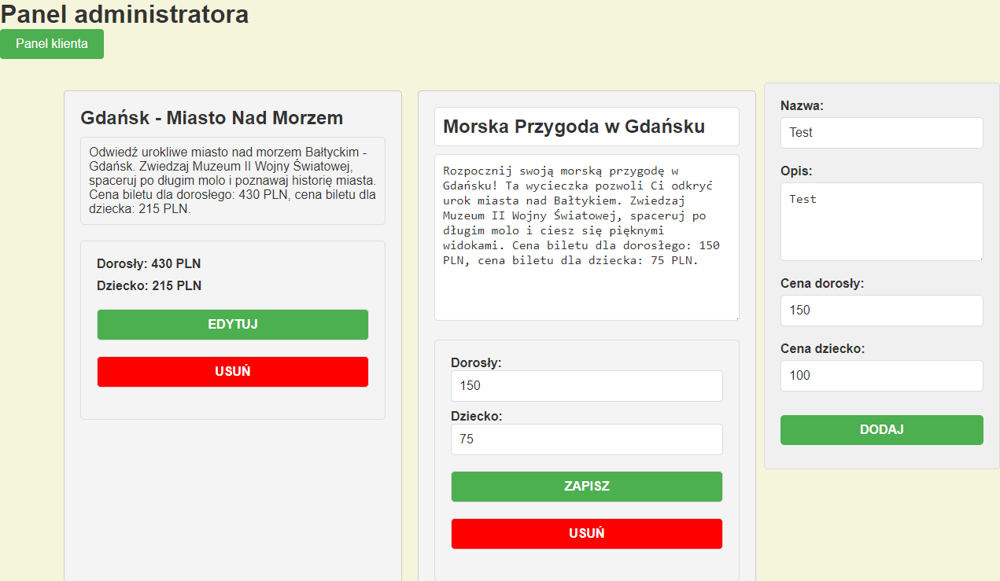
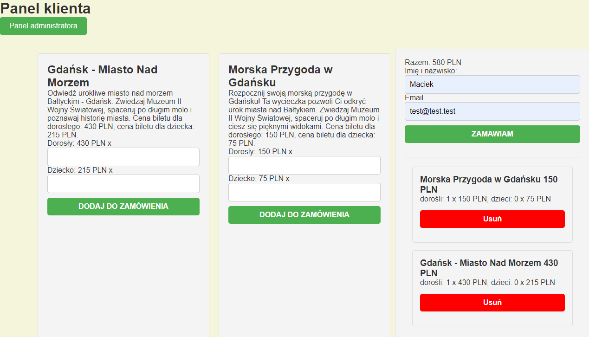

# JavaScript Fetch API - Excursions managment app 

The Excursions App is an intuitive platform that enables efficient management of tourist excursion offers in the administrator panel and provides a convenient order placement process for customers. The project has been implemented in JavaScript, utilizing HTML and CSS for the construction of an attractive user interface.

See the live version
[Soon... 🌐](#)

Note: The view is currently under construction and will be updated soon. Thank you for your understanding.
---
## Admin view
<div align="center">
  
</div>

---
## Client view
<div align="center">
  
</div>

---

## Functionalities

### Displaying Excursions
- The application fetches a list of available excursions from an external API.

### Adding Excursions
- The form allows the addition of new excursions by entering data such as title, description, price for adults and children.
- Data is validated, and a new excursion is added to the list and displayed on the page.

### Editing and Removing Excursions
- Each excursion has buttons for editing and removing, allowing for data updates and deletion of the excursion.

### Adding to Cart
- Customers can add excursions to the shopping cart by filling out a form with the quantities of tickets for adults and children.
- The cart list is dynamically rendered on the page, and users can browse and remove excursions from the cart.

### Order Summary
- After placing an order, the user receives an order summary in the form of a shopping list with the total price.

### Order Form Validation
- The order form is validated for the correctness of the entered data.
- The user receives an alert with information about errors if the data is invalid.

## 💡 Technologies

- 
- 
- 
- 
- 
- 
- 

## 💿 Installation

1. First, perform a [fork](https://docs.github.com/en/pull-requests/collaborating-with-pull-requests/working-with-forks/fork-a-repo) (located at the top right corner of the page). This will create a copy of this repository on your GitHub account.

2. Clone the repository to your local machine using the [git clone](https://docs.github.com/en/repositories/creating-and-managing-repositories/cloning-a-repository) command.

3. Navigate to the project directory:

    ```bash
    cd your-project-directory
    ```

4. Install dependencies using [npm](https://docs.github.com/en/packages/working-with-a-github-packages-registry/working-with-the-npm-registry):

    ```bash
    npm install
    ```

5. JSON Server
    ```bash
    json-server --watch ./data/excursions.json
    ```

6. Start the app:

    ```bash
    npm start
    ```

Now you can work on tasks in your own repository and contribute to the project.

## 🙋‍♂️ Feel free to contact me

[](https://www.linkedin.com/in/maciek-n%C4%99cka/)
